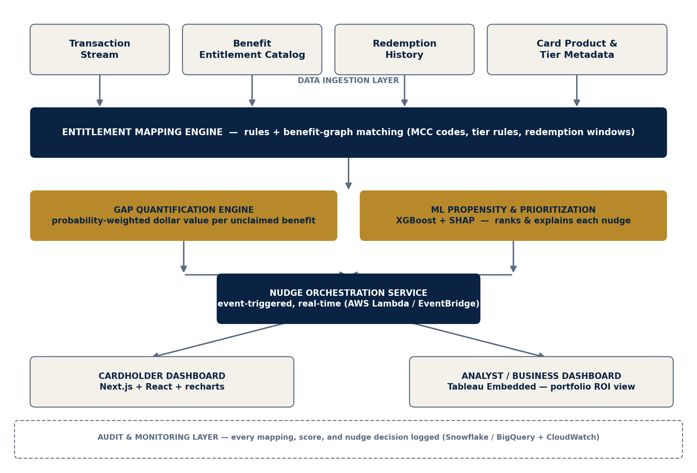
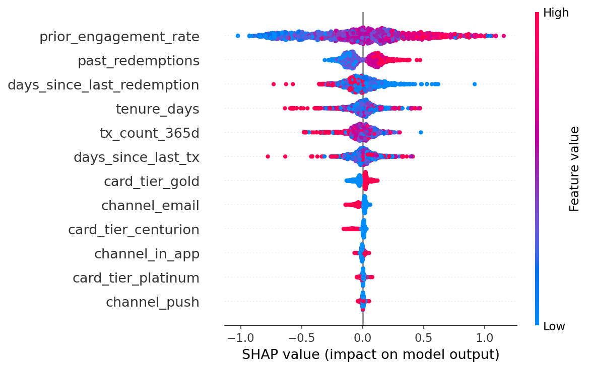
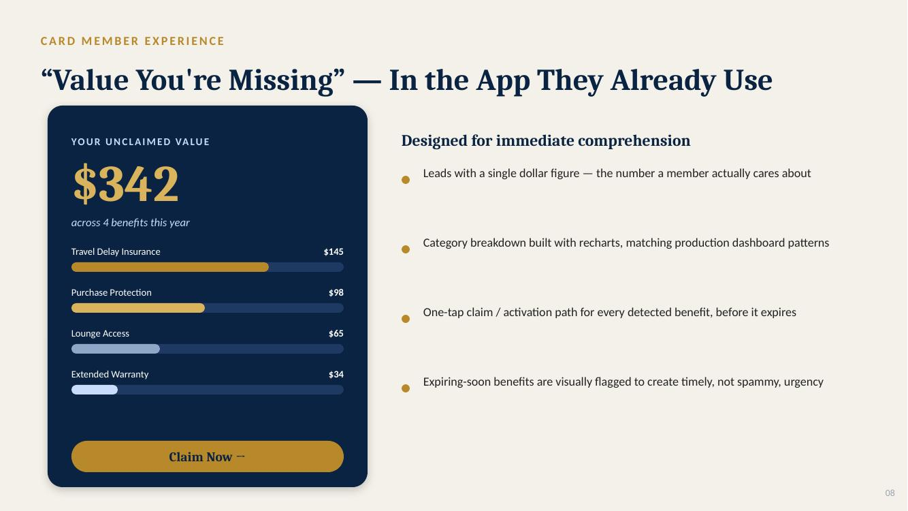

# BenefitIQ

[](https://github.com/YOUR_USERNAME/benefitiq/actions/workflows/ci.yml)

**See the value you've already paid for.**

BenefitIQ is an AI-driven benefit-underutilization analytics engine, built for the
**CodeStreet — Benefit-Underutilization Analytics** challenge. It reconciles a card
member's transaction history against their card's full benefit-entitlement catalog,
prices every unclaimed benefit in real dollars, and uses a trained propensity model
— not a blanket broadcast — to decide who to nudge, about what, and when.

This is a complete, runnable implementation: synthetic data generation, a
rule-based entitlement mapping engine, a dollar-value gap quantifier, an
XGBoost + SHAP propensity model, a FastAPI backend, and a Next.js frontend
with both a card-member dashboard and a business-analyst dashboard.

> All data in this repository is synthetically generated. No real cardholder,
> transaction, or issuer data is used anywhere in this project.

📄 [Full project description](docs/BenefitIQ_Project_Description.docx) · 🖥️ [Pitch deck](docs/BenefitIQ_Pitch_Deck.pptx)

---

## Why this exists

Card issuers invest heavily in benefit ecosystems — purchase protection, travel-delay
insurance, lounge access, extended warranty, cashback categories — but have no
reliable way to measure how much of that entitled value actually gets used. Card
members are often unaware of coverage they already hold, so perceived card value
quietly drifts below actual value. Independent industry research on rewards
cardholders gives a directional sense of scale: a 2022 LendingTree survey found
close to 70% of rewards cardholders sitting on some unused cash back, points, or
miles. Protection and insurance-style benefits — this project's focus — are
typically even less visible, since there's no running balance to remind a
cardholder they exist.

On this project's own synthetic portfolio, the same pattern shows up by
construction: **~85% of a sampled 150 members carry at least one unclaimed,
still-eligible benefit**, averaging **~$280 per member** in unclaimed value. See
[Results on the synthetic dataset](#results-on-the-synthetic-dataset) below for the exact numbers this build produced.

## Architecture



Seven layers, each independently deployable and scalable:

| Layer | What it does | Where it lives |
|---|---|---|
| Data Ingestion | Synthetic transactions, benefit catalog, redemption + engagement history | `data/` |
| Entitlement Mapping Engine | Rule-based matching of transactions to benefit eligibility (MCC codes, tier rules, time windows) | `backend/app/entitlement_engine.py` |
| Gap Quantification Engine | Probability-weighted dollar valuation from historical redemption distributions | `backend/app/entitlement_engine.py` |
| ML Propensity & Prioritization | XGBoost model + SHAP explainability | `ml/train_propensity_model.py`, `backend/app/propensity.py` |
| Nudge Orchestration | Scores and explains the single best nudge per member | `backend/app/main.py` (`/api/members/{id}/nudge`) |
| Presentation Layer | Card-member dashboard + analyst dashboard | `frontend/` |
| Audit Layer | Every score and explanation is returned by the API, not hidden in a black box | throughout |

## Tech stack

Built entirely from the technologies suggested for this theme:

- **Frontend (member):** React, Next.js 14 (App Router), TypeScript, Tailwind CSS
- **Frontend (analyst):** Recharts (standing in for Tableau Embedded Analytics in this offline build — see [Notes on scope](#notes-on-scope))
- **Backend & APIs:** Python, FastAPI
- **Data analytics:** pandas, NumPy
- **Machine learning:** XGBoost, scikit-learn, SHAP
- **Cloud target (production):** AWS Lambda / EventBridge / ECS, Snowflake or BigQuery — this repo runs the same architecture locally on SQLite-free flat files so anyone can clone and run it with no cloud account

## Repository structure

```
benefitiq/
├── data/                       synthetic data generator + generated CSVs/JSON
│   └── generate_synthetic_data.py
├── ml/                         model training pipeline
│   ├── train_propensity_model.py
│   └── model_artifacts/        trained model, metrics, SHAP plot (committed)
├── backend/                    FastAPI service
│   └── app/
│       ├── entitlement_engine.py   Task 1 & 2: mapping + gap quantification
│       ├── propensity.py           Task 4: ML scoring + SHAP explanations
│       └── main.py                 API routes
├── frontend/                   Next.js app (member + analyst dashboards)
│   ├── app/
│   │   ├── page.tsx                 card member dashboard
│   │   └── analyst/page.tsx         business analyst dashboard
│   ├── components/
│   └── lib/api.ts                   typed API client
└── docs/                       architecture diagram, project description, pitch deck
```

## Getting started

Requires Python 3.10+ and Node.js 18+.

### 1. Generate the synthetic dataset

```bash
cd data
pip install -r requirements.txt
python generate_synthetic_data.py
```

This writes `card_products.json`, `cardholders.csv`, `transactions.csv`,
`redemption_history.csv`, and `engagement_history.csv` into `data/`. (Already
generated and committed — re-run any time to reshuffle the synthetic population.)

### 2. Train the propensity model

```bash
cd ml
pip install -r requirements.txt
python train_propensity_model.py
```

Writes the trained XGBoost model, metrics, and SHAP summary plot to
`ml/model_artifacts/` (already committed — re-run to retrain from scratch).

### 3. Run the backend

```bash
cd backend
pip install -r requirements.txt
uvicorn app.main:app --reload --port 8000
```

API docs at `http://localhost:8000/docs`. Try it immediately:

```bash
curl http://localhost:8000/api/members/M00000/summary
curl "http://localhost:8000/api/analytics/portfolio?sample_size=100"
```

### 4. Run the frontend

```bash
cd frontend
npm install
cp .env.local.example .env.local   # points the app at the local API
npm run dev
```

Visit `http://localhost:3000` for the card-member dashboard and
`http://localhost:3000/analyst` for the business-analyst dashboard.

## API reference

| Endpoint | Description |
|---|---|
| `GET /api/members?limit=&card_tier=` | List synthetic members |
| `GET /api/members/{id}/summary` | Unclaimed entitlements, dollar values, and the top-ranked nudge for one member |
| `GET /api/members/{id}/nudge?channel=` | Propensity score + SHAP explanation for a specific channel |
| `GET /api/analytics/portfolio?sample_size=` | Portfolio-wide aggregation for the analyst dashboard |
| `GET /api/model/metrics` | Training metrics for the propensity model (AUC-ROC, calibration, SHAP feature ranking) |

## Results on the synthetic dataset

Numbers from this repository's own generated data and trained model (fully
reproducible via the commands above):

| Metric | Value |
|---|---|
| XGBoost propensity model — AUC-ROC | **0.769** |
| Logistic regression baseline — AUC-ROC | 0.637 |
| Mean calibration gap | 0.078 (lower is better) |
| Training records | 8,479 synthetic engagement events |
| Underutilization rate (150-member sample) | **85%** of members carry ≥1 unclaimed entitlement |
| Avg unclaimed value per member (same sample) | **$280** |

**Top SHAP drivers of nudge propensity:**



1. `prior_engagement_rate` — by far the strongest signal, as expected
2. `past_redemptions`
3. `days_since_last_redemption`
4. `tenure_days`
5. `tx_count_365d`

The XGBoost model beating the interpretable linear baseline by ~13 points of
AUC-ROC is the empirical justification for Section 7.5 of the project
description: propensity is not a linear function of these features, so the
extra model complexity earns its place.

## Design concept

The dashboards you get from `npm run dev` above are the real, functioning UI.
For a quick visual reference without running anything, here's the original
design concept from the pitch deck:



## Notes on scope

This is a hackathon-stage build, and a few things are deliberately simplified
so the whole system can be cloned and run by anyone with no cloud account or
paid services:

- **Data is synthetic**, generated by `data/generate_synthetic_data.py` with a
  fixed random seed. The generating process (see the script) is designed to
  mirror realistic distributions, not to represent any real issuer's book of
  business.
- **Tableau Embedded Analytics** (suggested for the analyst frontend) is
  represented here with Recharts, since Tableau requires a licensed workspace
  this repo can't assume the reader has. The API contract (`/api/analytics/portfolio`)
  is the same regardless of which charting layer sits on top of it.
- **Cloud services** (AWS Lambda/EventBridge, Snowflake/BigQuery) are
  represented by the FastAPI service and flat files respectively. The
  architecture is designed so those are swap-in replacements, not a redesign
  — see `docs/BenefitIQ_Project_Description.docx` Section 8 for the
  scalability argument.
- **The nudge orchestration service** (event-triggered timing/frequency
  capping) is represented by the scoring endpoint; a production build would
  add the actual event bus and delivery channels.

## Roadmap

- [x] Synthetic data generation
- [x] Entitlement mapping engine (rule-based, MCC-indexed)
- [x] Dollar-value gap quantification
- [x] XGBoost propensity model with SHAP explainability
- [x] FastAPI backend with full API surface
- [x] Next.js card-member dashboard
- [x] Next.js analyst dashboard with live charts
- [ ] Real Tableau Embedded integration for the analyst view
- [ ] Event-driven nudge delivery (AWS Lambda/EventBridge)
- [ ] Pilot on anonymized, sandboxed real entitlement data

## License

MIT — see [LICENSE](LICENSE).

---

Built for CodeStreet 2026 · Theme: Benefit-Underutilization Analytics
